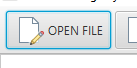
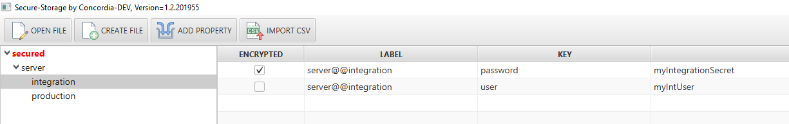
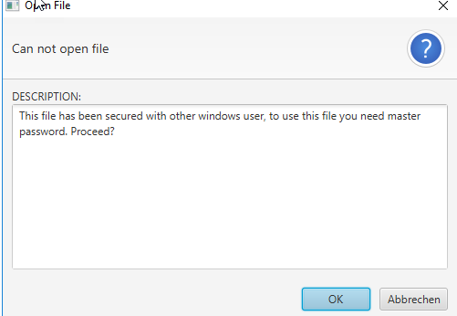
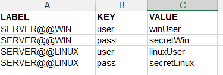
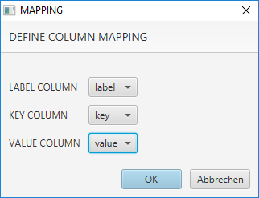
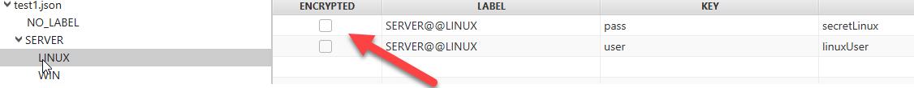
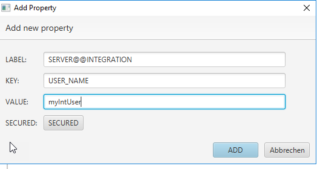
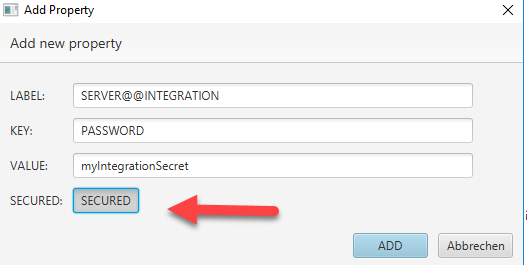
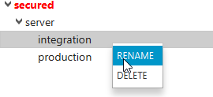
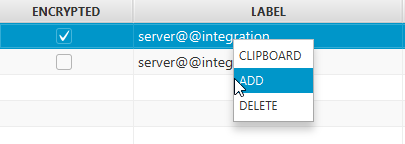

= Secure storage (secured properties)
Vedran Bauer
v1.2, 2019-06-05


== Introduction

Main use case of this application is to store properties or credentials in secure way in a file and
to use them within windows network on any server.
Security is provided by a built-in cryptographic feature called "Windows Data Protection API" (DPAPI), which allows any application to securely encrypt confidential user data using the user's credentials in a way that it can only be decrypted by the same user.
Therefore the link:https://github.com/peter-gergely-horvath/windpapi4j[windpapi4j] library is used to achieve this goal.
To encrypt values in the file, a master password is used which must be defined first time the file is created.
This master password is then encrypted with DPAPI and stored in the file.
You will not be asked to enter master password again as long as you are using the secured file if you are logged in
windows with the same user you created the file with.
If the secure file has been encrypted with other user and you try to open it, you will be asked to
provide the master password. If you have the correct one, the secure file will be re-encrypted with your
windows credentials again.


=== Properties structure

Properties are simple KEY/VALUE pair. I have added a label functionality to it, to be able to create tree-like structure within and to group properties.
You can add any property without label as well. Labels and key are separated with *"@@"*.

                    `label@@label@@label@@....@@key`


===== EXAMPLE

```
* server@@integration@@user=myIntUser
* server@@integration@@password=myIntegrationSecret
* server@@production@@user=myProdUser
* server@@production@@password=myProductionSecret
```

IMPORTANT: Labels and keys are case sensitive! server@@user != Server@@user


== Quick Start

=== create file

`secured-properties -create c:\temp\secured -pass 12345678`

`output: Storage created`

=== add properties

`secured-properties -addUnsecured c:\temp\secured -key server@@integration@@user -value myIntUser`

`secured-properties -addSecured   c:\temp\secured -key server@@integration@@password -value myIntegrationSecret`

`secured-properties -addUnsecured c:\temp\secured -key server@@production@@user -value myProdUser`

`secured-properties -addUnsecured c:\temp\secured -key server@@production@@password -value myProductionSecret`

=== print file

`secured-properties -print c:\temp\secured`

*Output*
....
Printing content of the file->c:\temp\secured

File is WIN-secured with current user, can be open in protected mode without password


-------------------server@@integration---------------
password=lfIn/gD9PqpcZ6xyk8Gk342KwrHOVK2B
user=myIntUser
-------------------server@@production---------------
password=myProductionSecretsecureStorage
user=myProdUser
----------------------------------
....

=== read property

....
secured-properties -getValue c:\temp\secured -key server@@integration@@password
....

*output*

....
myIntegrationSecret
....


=== Start GUI
....
secured-properties -gui
....

=== Open file





== Console

You can use command line to get secured passwords in your scripts.

=== EXAMPLE

test.ps1
[source,powershell]
----
$pass = secured-properties -getValue c:\Users\juid32\secStorage.json -key connection@@test@@password
Write-Host password is $pass
----

will result in

`password is dfdfdfdf`


=== Help

`secured-properties -help`


=== Create Storage

Create new secure storage, file name is teststorage.json and password is *mySECRET*.

`secured-properties -create testStorage.json -pass mySECRET"`

=== Add property

Add unencrypted property *user* with value *admin*.

`secured-properties -addUnsecured testStorage.json -key user -value admin`

*or with label "server"*

`secured-properties -addUnsecured testStorage.json -key server@@user -value admin`


Add encrypred property *password* with the value *sEcRETString* to storage.

`secured-properties -addSecured testStorage.json -key password -value sEcRETString`

=== Get property

Get named property *user* from secure storage.

INPUT: `secured-properties -getValue testStorage.json -key user`

OUTPUT: `admin`

Get named property *password* from secure storage.

INPUT: `secured-properties -getValue testStorage.json -key password`

OUTPUT: `sEcRETString`


=== Print storage

`secured-properties -print testStorage.json`


=== Start GUI

`secured-properties -gui`


== GUI

== Start GUI

`secured-properties -gui`

== Open File

Open existing file.


If file has been encrypted with other user in Windows, it will ask for master password.



If you provide correct master password, the file will be reencrypted with current user.
If not, it will not open.

== Create File

Creates new secured properties file. It will ask you to provide master password.
As long as you do not wish to recrypt the file with some other windows user, you will not
be needing this password.

== Import from CSV
You can import your properties from CSV File.
First row in CSV file must be column name.

.Must define
- Column contains key
- Column containing value

.Optional
- Column containing label



After you have selected the file, you will be asked to define column maping.



After import, you can encrypt values by clicking on check box.



== ADD Property

=== Unsecured

Add unsecured property with labels: SERVER@@INTEGRATION, KEY=USER_NAME and VALUE=myIntUser.



=== Secured

Add encrypted property with labels: SERVER@@INTEGRATION, KEY=PASSWORD and VALUE=myIntegrationSecret.



== Encrypt/Decrypt property

Just click on check box in *encrypted" column. It will encrypt/decrypt the value

== Rename label

You can rename a label in the tree by selecting it and click with right mouse button.
It will then apply to all properties.



== Delete all properties with label
You can delete all properties which have defined label by selecting it in the tree view
and click on the righ mouse button.

image::resources/deleteLabel.png[deleteLabel]
image::resources/confirmDeletion.png[confirmDeletion]

== Single selectio menu

By selecting one property in the table and click on the right mouse button you can:

1. Add single property
2. Delete single property
3. Copy the value of single property in memory




